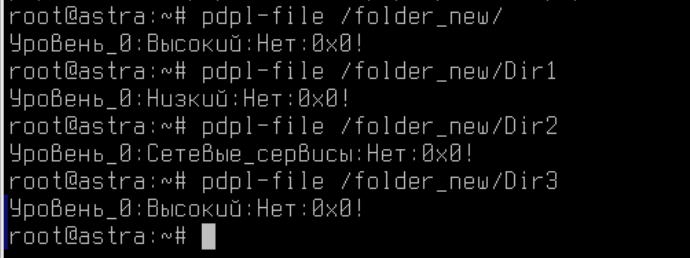

# Лабораторная работа №10. Тема: "Мандатный контроль целостности в Astra Linux Special Edition"

Цель работы
----------
- Изучить мандатный контроль целостности в Astra Linux Special Edition.


Оборудование, ПО:
----------

Виртуальная машина или компьютер под управлением ОС AstraLinux 1.7 в режиме защищенности "Воронеж" или выше.

Чтобы выполнять задачи по администрированию в Astra Linux мандатного контроля целостности, ваша учетная запись должна иметь следующие настройки:

* Запускать команды и процессы от имени учетной записи суперпользователя root;

Помните, что во время установки ОС Astra Linux создается учетная запись группы astra-admin. Включенным в эту группу учетным записям разрешено выполнять команды от имени суперпользователя root с помощью консольной утилиты **sudo**.

* Запускать команды и процессы с уровнем целостности "Высокий".

Для использования команд с уровнем целостности "Высокий" учетной записи должны быть назначен соответствующий уровень целостности. Сделать это можно: 

1) С использованием команды **pdpl-user**. Синтаксис следующий: 

```
pdpl-user -i [требуемый уровень целостности] [имя_учетной_записи]
```

Например, для пользователя ansible команда была бы: 

```
pdpl-user -i 63 ansible
```

2) С помощью программы "Политика безопасности" в меню Пуск или по запуску командой - 

```
fly-admin-smc
```


Ход работы:
----------

# Что будем делать сейчас?

В данной лабораторной работе мы обсудим как администрировать МКЦ в Astra Linux.

Как его включить? 

Предположим, что до этой лабораторной работы вы МКЦ не включал, сделать это можно:

1) Консольной утилитой **set-fs-ilev**. Данная утилита позволяет: 

  * Узнать текущее состояние защиты файловой системы с использованием МКЦ:
  
    ```
    set-fs-ilev status
    ```


  * Включить или выключить МКЦ на файловой системе: 

  ```
  set-fs-ilev enable 
  ```
  
  Или

  ```
  set-fs-ilev disable 
  ```

  * Получить список каталогов, в которых будет включен МКЦ после работы:

  ```
  set-fs-ilev  defconfig
  ```

Список каталогов, в которых будет включен МКЦ, хранится в конфигурационном файле - **/etc/parsec/fs-ilev.conf**.


# Отправляемся трудиться!

Первым делом, создадим УЗ - linuxuser. 

```
sudo adduser linuxuser
```


Далее добавим его в группу astra-admin

```
sudo usermod -a linuxuser -G astra-admin
```

А проверить можем вот так - 

```
id linuxuser
```


Затем необходимо назначить максимальный уровень целостности - 

```
sudo pdpl-user -i 63 linuxuser
```


## Проверить правильность выполнения задания просто - попробуйте зайти под linuxuser в режим высокого уровня целостности.

Теперь, мы получили (или закрепили) навык создания локальных учетных записей администратора.

# А что же дальше? 

Теперь, пора поработать с файловой системой в рамках МКЦ.

Обратимся к терминологии из документации:

"В соответствии с правилами МКЦ уровень целостности каталога не может быть ниже уровня целостности содержащихся в нем сущностей (файлов и подкаталогов) файловой системы. При этом даже процессы от имени администратора безопасности Astra Linux на уровне целостности "Высокий" не могут обойти данное ограничение.

Создание и\или удаление сущностей файловой системы связано с внесением изменений в структуру и содержание каталога, т.е. соответствует доступу на запись в него. В связи с этим правилами МКЦ осуществление таких действий разрешено только при условии, что уровень целостности субъекта (процесса) не ниже уровня целостности целевого каталога или файла"

Для просмотра или изменения уровня целостности файлов или каталогов используется:

1) Утилита pdpl-file.

Синтаксис использования утилиты следующий:

```
pdpl-file [параметры] [уровень] [:уровень_целостности[:категория[:флаги]]] [сущность]
```

Разберем на реальном примере.

Если вы планируете назначить высокий уровень целостности для каталога /tmp, команда будет такой:

```
sudo pdpl-file  :63 /tmp
```

А как посмотреть настройки целостности на файл? 

```
sudo pdpl-file /tmp
```


# Еще немного практики? 

Создайте самостоятельно каталоги и укажите им уровень целостности, в соответствии с таблицей:

| Каталог | Уровень целостности 
| ------- | ------------------- 
| /folder_new  | Высокий(63) 
| /folder_new/Dir1 | Низкий (0) 
| /folder_new/Dir2  | Сетевые сервисы (1)  
| /folder_new/Dir3  | Высокий(63) 

Затем создайте пользователя с низким уровнем целостности, например, liluser.

Проверить, что каталогам назначены правильные настройки можно так -



А теперь, для того чтобы действительно убедиться в работе МКЦ. Введите команду - 

```
sudo chmod 777 -R /folder_new
```

С помощью данной команды, мы назначаем дискреционные права доступа ко всем каталогам созданной иерархии для обеспечения полного доступа (rwx) к ним для всех учетных записей пользователей.


Затем, давайте зайдем в систему под нашим пользователем liluser и проверим, что он может делать с нашими каталогами.


Доступа нет, что и требовалось доказать.

# Пробуем повысить уровень целостности пользователя liluser до уровня уровня "Сетевые сервисы".

Перейдите в учетную запись администратора и повысьте привилегии командой -

```
sudo pdpl-user -i 1 liluser
```


Войти в систему под новым пользователем можно вот так - 


Проверяем, куда мы можем вносить корректировки в нашей файловой иерархии - 


Имея 1 уровень целостности мы можем вносить корректировки в директориях, на одном с нами уровне целостности, а также на нижних. Выше доступа нет, не смотря на максимальные права доступа в дискреционной системе  прав Linux.

# Заключение

В результате прохождения данного курса вы приобрели необходимые навыки для эффективного управления мандатного управления доступом. Мы освоили основные концепции и инструменты МКЦ, освоили методы  управления над файловой системой. 

В следующем материале вы познакомитесь с темой  - Настройка подсистемы аудита в Astra Linux Special Edition.

Благодарю за чтение и успехов вам в обучении!


# Дополнительная информация:
1) Полное включение МКЦ [Ссылка](https://wiki.astralinux.ru/pages/viewpage.action?pageId=144312274)
2) Основы безопасности операционной системы Astra Linux Special Edition  [Ссылка](https://www.techbook.ru/book.php?id_book=1247)
